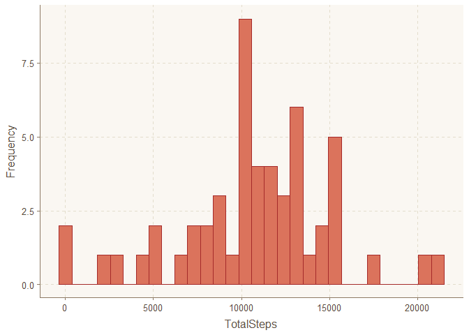
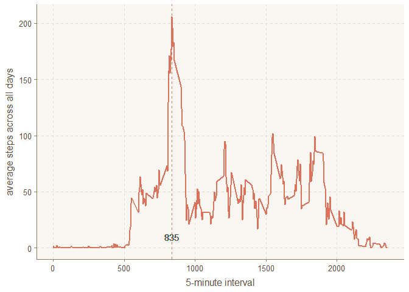
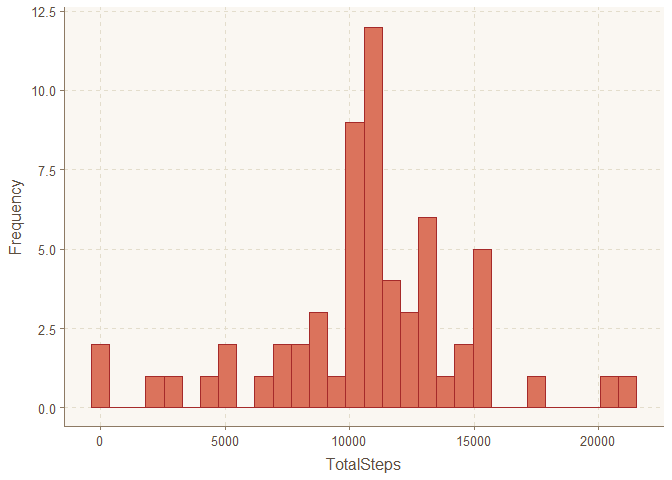
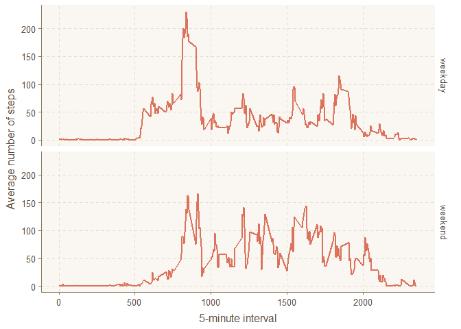

## Loading and preprocessing the data

Load the data by using read.csv(), then process the data into a format suitable for analysis


```r
# Read data
data <- read.csv("activity.csv")
# Change date format to Date
data$date <- as.Date(data$date, "%Y-%m-%d")
# Check sturcture of the data
str(data)
```

```
## 'data.frame':	17568 obs. of  3 variables:
##  $ steps   : int  NA NA NA NA NA NA NA NA NA NA ...
##  $ date    : Date, format: "2012-10-01" "2012-10-01" ...
##  $ interval: int  0 5 10 15 20 25 30 35 40 45 ...
```

## What is mean total number of steps taken per day?


```r
# Calculate the total number of steps taken per day
total_steps <- aggregate(data$steps, by = list(data$date), sum)
names(total_steps) <- c("Date", "TotalSteps")
head(total_steps, 10)
```

```
##          Date TotalSteps
## 1  2012-10-01         NA
## 2  2012-10-02        126
## 3  2012-10-03      11352
## 4  2012-10-04      12116
## 5  2012-10-05      13294
## 6  2012-10-06      15420
## 7  2012-10-07      11015
## 8  2012-10-08         NA
## 9  2012-10-09      12811
## 10 2012-10-10       9900
```

```r
# plot histogram of the total number of steps taken per day
library(ggplot2)
```

```
## Warning: package 'ggplot2' was built under R version 3.5.2
```

```r
library(scales)
```

```
## Warning: package 'scales' was built under R version 3.5.2
```

```r
library(ggthemr)
ggthemr("dust")
g <- ggplot(total_steps, aes(TotalSteps))
g + geom_histogram(col = "brown") +
        ylab("Frequency")
```

```
## `stat_bin()` using `bins = 30`. Pick better value with `binwidth`.
```

```
## Warning: Removed 8 rows containing non-finite values (stat_bin).
```

<!-- -->

```r
# Calculate the mean and median of the total number of steps taken per day
summary(total_steps$TotalSteps)
```

```
##    Min. 1st Qu.  Median    Mean 3rd Qu.    Max.    NA's 
##      41    8841   10765   10766   13294   21194       8
```

#### The mean value is 10766, and the median is 10765.

## What is the average daily activity pattern?


```r
# Calculate average steps accross all days
ave_steps <- aggregate(data$steps, by = list(data$interval), mean, na.rm = TRUE)
names(ave_steps) <- c("interval", "averagesteps")
max_step <- ave_steps[which.max(ave_steps$averagesteps),]
# make a time series plot
ag <- ggplot(ave_steps, aes(x = interval, y = averagesteps))
ag + geom_line(size = 1) + xlab("5-minute interval") + ylab("average steps across all days") +
        geom_vline(xintercept = max_step$interval, linetype = "dashed") +
        geom_text(aes(max_step$interval,0,label = max_step$interval, vjust = -1))
```

<!-- -->

```r
# 5-minute interval contains maximum number of steps
max_step
```

```
##     interval averagesteps
## 104      835     206.1698
```

## Imputing missing values


```r
# Calculate the total number rows of missing values in the dataset
sum(is.na(data))
```

```
## [1] 2304
```

```r
# fill in the NAs with mean for that 5-minute interval
na <- data[is.na(data),]
nadate <- unique(na$date)
new_data <- data
for (i in 1:8){
new_data[new_data$date == nadate[i],]$steps <- ave_steps$averagesteps
}
head(new_data)
```

```
##       steps       date interval
## 1 1.7169811 2012-10-01        0
## 2 0.3396226 2012-10-01        5
## 3 0.1320755 2012-10-01       10
## 4 0.1509434 2012-10-01       15
## 5 0.0754717 2012-10-01       20
## 6 2.0943396 2012-10-01       25
```

```r
# Calculate the total number of steps taken per day
new_total_steps <- aggregate(new_data$steps, by = list(new_data$date), sum)
names(new_total_steps) <- c("Date", "TotalSteps")
head(new_total_steps, 10)
```

```
##          Date TotalSteps
## 1  2012-10-01   10766.19
## 2  2012-10-02     126.00
## 3  2012-10-03   11352.00
## 4  2012-10-04   12116.00
## 5  2012-10-05   13294.00
## 6  2012-10-06   15420.00
## 7  2012-10-07   11015.00
## 8  2012-10-08   10766.19
## 9  2012-10-09   12811.00
## 10 2012-10-10    9900.00
```

```r
# make a new histogram for the new dataset
n_g <- ggplot(new_total_steps, aes(TotalSteps))
n_g + geom_histogram(col = "brown") +
        ylab("Frequency")
```

```
## `stat_bin()` using `bins = 30`. Pick better value with `binwidth`.
```

<!-- -->

```r
# Calculate the mean and median of the total number of steps taken per day
summary(new_total_steps$TotalSteps)
```

```
##    Min. 1st Qu.  Median    Mean 3rd Qu.    Max. 
##      41    9819   10766   10766   12811   21194
```

```r
summary(total_steps$TotalSteps)
```

```
##    Min. 1st Qu.  Median    Mean 3rd Qu.    Max.    NA's 
##      41    8841   10765   10766   13294   21194       8
```
#### From the summaries above, after the NAs have filled in with mean values for that 5-minutes interval, the mean value doesn't change. However, the median has increased to 10766.

## Are there differences in activity patterns between weekdays and weekends?

```r
# Set output language to English
Sys.setlocale("LC_TIME", "English")
```

```
## [1] "English_United States.1252"
```

```r
# Create new factor variable "weekday" "weekend"
new_data$day <- weekdays(new_data$date)
new_data$week <- ""
new_data[new_data$day == "Saturday" | new_data$day == "Sunday", ]$week <- "weekend"
new_data[!(new_data$day == "Saturday" | new_data$day == "Sunday"), ]$week <- "weekday"
new_data$week <- factor(new_data$week)
head(new_data)
```

```
##       steps       date interval    day    week
## 1 1.7169811 2012-10-01        0 Monday weekday
## 2 0.3396226 2012-10-01        5 Monday weekday
## 3 0.1320755 2012-10-01       10 Monday weekday
## 4 0.1509434 2012-10-01       15 Monday weekday
## 5 0.0754717 2012-10-01       20 Monday weekday
## 6 2.0943396 2012-10-01       25 Monday weekday
```

```r
average <- aggregate(new_data$steps, by = list(new_data$interval, new_data$week), mean)
names(average) <- c("interval", "week", "steps")
# Make a panel plot
library(ggplot2)
ggplot(average, aes(interval, steps, group = week)) +
        geom_line(size = 1) + facet_grid(week ~.) + 
        xlab("5-minute interval") + ylab("Average number of steps")
```

<!-- -->
